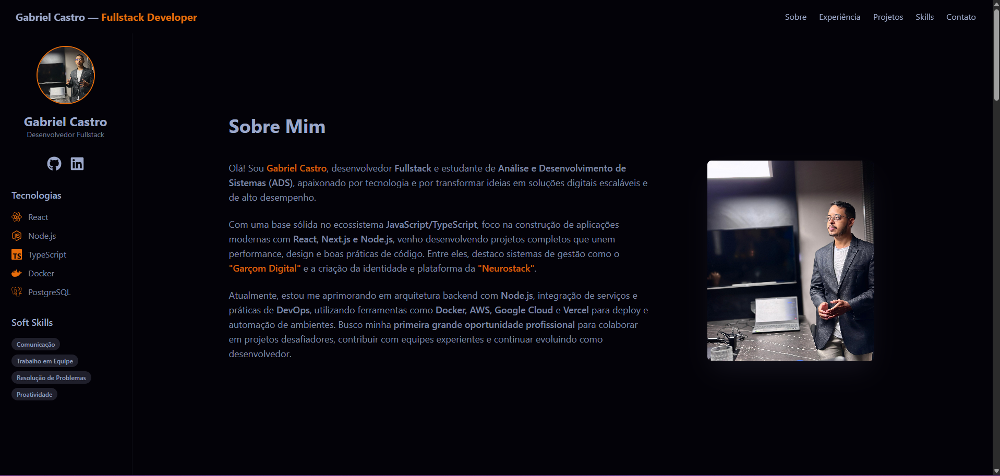

<div align="center">

# Portfólio — Gabriel Castro

<a href="https://gabriel-castro-portfolio.vercel.app" target="_blank">
  
</a>
<a href="https://www.linkedin.com/in/gabriel-castro-9a9745209/" target="_blank">
  
</a>
<a href="mailto:gabriel.castrogt10@gmail.com" target="_blank">
  
</a>

<br/>
<br/>

Projeto do meu portfólio pessoal com foco em **Front-end (React/TypeScript)**, **UI moderna**, **responsividade** e **animações sutis**.

✅ **Acesse:** https://gabriel-castro-portfolio.vercel.app

</div>

---

## ✨ Preview



---

## 🚀 Funcionalidades

- Design moderno e responsivo (Mobile First)
- Portfólio one-page com navegação suave entre seções
- Animações com Framer Motion
- Seções: Sobre, Experiência, Projetos, Skills e Contato
- Formulário de contato funcional com EmailJS (sem back-end)

---

## 🧰 Tecnologias

- React
- Vite
- TypeScript
- Tailwind CSS
- Framer Motion
- EmailJS
- ESLint

---

## ⚙️ Como rodar localmente (opcional)

> Se você for rodar no seu PC depois, siga:

1) Instale dependências:
```bash
yarn
