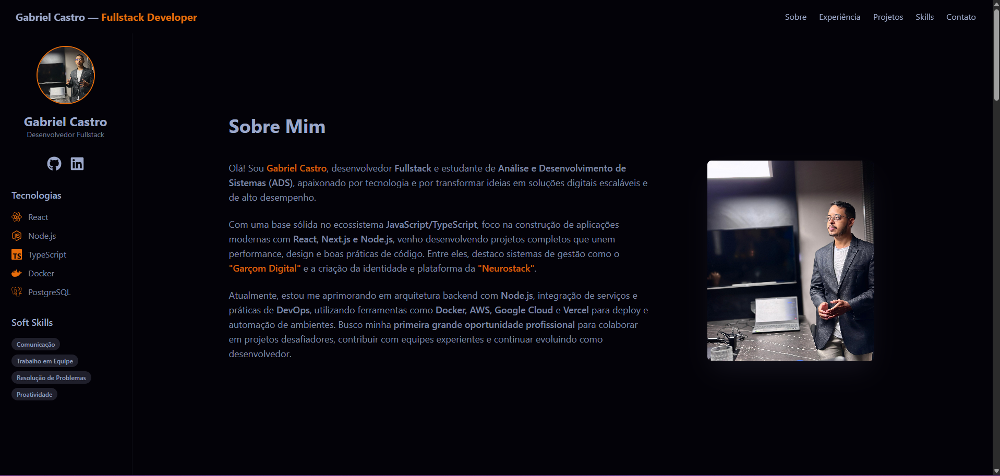

# 🚀 Portfólio Pessoal de Gabriel Castro

Bem-vindo ao repositório do meu portfólio pessoal! Este é um projeto one-page construído com as tecnologias mais modernas do ecossistema React, com o objetivo de apresentar minhas habilidades, experiências e projetos de forma clara, profissional e visualmente agradável.

### ✨ Visão Geral



---

### 📋 Funcionalidades Principais

* **🎨 Design Moderno e Responsivo:** Totalmente adaptado para desktops, tablets e celulares (Mobile First).
* **📄 Arquitetura One-Page:** Todas as informações em uma única página com navegação suave entre as seções.
* **🎬 Animações Sutis:** Efeitos de hover e animações de entrada com Framer Motion para uma experiência de usuário mais fluida e dinâmica.
* **📂 Seções Completas:**
    * **Sobre Mim:** Uma breve introdução profissional.
    * **Experiência:** Uma linha do tempo interativa com meu histórico profissional.
    * **Projetos:** Um grid de cards com meus principais projetos, incluindo links para o código no GitHub e para a versão ao vivo.
    * **Habilidades:** Lista de competências técnicas agrupadas por categoria.
* **📬 Formulário de Contato Funcional:** Integrado com o **EmailJS** para permitir o envio de e-mails diretamente pelo site, sem a necessidade de um back-end.

---

### 🛠️ Tecnologias Utilizadas

Este projeto foi construído utilizando as seguintes tecnologias e ferramentas:

* **Front-end:**
    * [React](https://reactjs.org/)
    * [Vite](https://vitejs.dev/)
    * [TypeScript](https://www.typescriptlang.org/)
    * [Tailwind CSS](https://tailwindcss.com/)
    * [Framer Motion](https://www.framer.com/motion/)
* **Utilitários:**
    * [EmailJS](https://www.emailjs.com/)
    * [React Icons](https://react-icons.github.io/react-icons/)
* **Gerenciador de Pacotes:**
    * [Yarn](https://yarnpkg.com/)

---

### ⚙️ Como Executar o Projeto Localmente

Para rodar este projeto na sua máquina, siga os passos abaixo:

1.  **Clone o repositório:**
    ```bash
    git clone [https://github.com/DevBielCastro/Gabriel-Castro_Portfolio.git](https://github.com/DevBielCastro/Gabriel-Castro_Portfolio.git)
    ```

2.  **Navegue até a pasta do projeto:**
    ```bash
    cd Gabriel-Castro_Portfolio
    ```

3.  **Instale as dependências:**
    (Este projeto utiliza o Yarn. Certifique-se de que o tenha instalado com `npm install -g yarn`)
    ```bash
    yarn
    ```

4.  **Configure as variáveis de ambiente:**
    * Crie um arquivo `.env.local` na raiz do projeto.
    * Adicione suas chaves do EmailJS, como no exemplo abaixo:
        ```env
        VITE_EMAILJS_SERVICE_ID=seu_service_id
        VITE_EMAILJS_TEMPLATE_ID=seu_template_id
        VITE_EMAILJS_PUBLIC_KEY=sua_public_key
        ```

5.  **Inicie o servidor de desenvolvimento:**
    ```bash
    yarn dev
    ```

O site estará disponível em `http://localhost:5173`.

---

### 📞 Contato

* **LinkedIn:** [linkedin.com/in/devbielcastro](https://www.linkedin.com/in/devbielcastro/)
* **E-mail:** `gabriel.castrogt10@gmail.com`